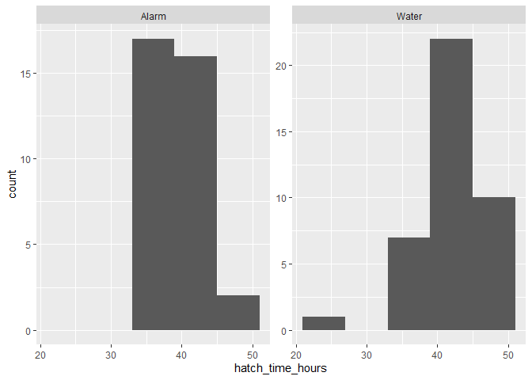
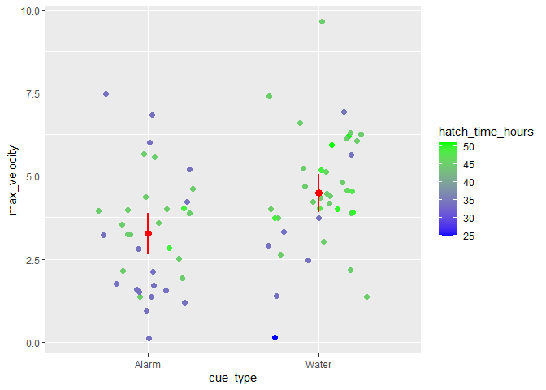

Zebrafish EDA Project
================

Effects of Chemical Alarm Cue on Zebrafish Embryonic and Early Life
Development

Abstract

> Zebrafish are able to sense alarm cue, chemicals released when another
> fish is attacked by a predator, in order to alert themselves of
> potential danger. Because of this, their behavior changes as an
> increase in overall activity as they try and avoid any potential
> predators nearby. A similar thing happens with zebrafish eggs, in that
> they can also sense alarm cue or mechanical disturbances nearby and
> will then hatch early as a response. While hatching early allows the
> hatchling to relocate and potentially avoid predators, it comes with
> the tradeoff of being underdeveloped compared to those who hatch at a
> normal time. Using both body measurements and swimming tests, we can
> determine whether each hatchling is underdeveloped. To compare the
> data, the hatchlings are sorted by both hatch time and cue type (alarm
> vs water). We can then compare body measurements (yolk height, body
> length, fin lengths, eye dimensions) and swimming ability (average and
> max swimming velocity.) This then allows us to show how chemical alarm
> cues effect embryonic development in zebrafish

Methods

> Renaming the data to fit code better.

    ## Warning: Expecting numeric in T2 / R2C20: got a date

    ## Warning: Expecting numeric in T3 / R3C20: got a date

    ## Warning: Expecting numeric in T4 / R4C20: got a date

    ## Warning: Expecting numeric in T5 / R5C20: got a date

    ## Warning: Expecting numeric in T6 / R6C20: got a date

    ## Warning: Expecting numeric in T7 / R7C20: got a date

    ## Warning: Expecting numeric in T8 / R8C20: got a date

    ## Warning: Expecting numeric in T9 / R9C20: got a date

    ## Warning: Expecting numeric in T10 / R10C20: got a date

    ## Warning: Expecting numeric in T11 / R11C20: got a date

    ## Warning: Expecting numeric in T12 / R12C20: got a date

    ## Warning: Expecting numeric in T13 / R13C20: got a date

    ## Warning: Expecting numeric in T14 / R14C20: got a date

    ## Warning: Expecting numeric in T15 / R15C20: got a date

    ## Warning: Expecting numeric in T16 / R16C20: got a date

    ## Warning: Expecting numeric in T17 / R17C20: got a date

    ## Warning: Expecting numeric in T18 / R18C20: got a date

    ## Warning: Expecting numeric in T19 / R19C20: got a date

    ## Warning: Expecting numeric in T20 / R20C20: got a date

    ## Warning: Expecting numeric in T21 / R21C20: got a date

    ## Warning: Expecting numeric in T22 / R22C20: got a date

    ## Warning: Expecting numeric in T23 / R23C20: got a date

    ## Warning: Expecting numeric in T24 / R24C20: got a date

    ## Warning: Expecting numeric in T25 / R25C20: got a date

    ## Warning: Expecting numeric in T27 / R27C20: got a date

    ## Warning: Expecting numeric in T28 / R28C20: got a date

    ## Warning: Expecting numeric in T29 / R29C20: got a date

    ## Warning: Expecting numeric in T30 / R30C20: got a date

    ## Warning: Expecting numeric in T31 / R31C20: got a date

    ## Warning: Expecting numeric in T32 / R32C20: got a date

    ## Warning: Expecting numeric in T33 / R33C20: got a date

    ## Warning: Expecting numeric in T34 / R34C20: got a date

    ## Warning: Expecting numeric in T35 / R35C20: got a date

    ## Warning: Expecting numeric in T36 / R36C20: got a date

    ## Warning: Expecting numeric in T37 / R37C20: got a date

    ## Warning: Expecting numeric in T38 / R38C20: got a date

    ## Warning: Expecting numeric in T39 / R39C20: got a date

    ## Warning: Expecting numeric in T40 / R40C20: got a date

    ## Warning: Expecting numeric in T41 / R41C20: got a date

    ## Warning: Expecting numeric in T42 / R42C20: got a date

    ## Warning: Expecting numeric in T43 / R43C20: got a date

    ## Warning: Expecting numeric in T44 / R44C20: got a date

    ## Warning: Expecting numeric in T45 / R45C20: got a date

    ## Warning: Expecting numeric in T46 / R46C20: got a date

    ## Warning: Expecting numeric in T47 / R47C20: got a date

    ## Warning: Expecting numeric in T48 / R48C20: got a date

    ## Warning: Expecting numeric in T49 / R49C20: got a date

    ## Warning: Expecting numeric in T50 / R50C20: got a date

    ## Warning: Expecting numeric in T51 / R51C20: got a date

    ## Warning: Expecting numeric in T52 / R52C20: got a date

    ## Warning: Expecting numeric in T53 / R53C20: got a date

    ## Warning: Expecting numeric in T54 / R54C20: got a date

    ## Warning: Expecting numeric in T55 / R55C20: got a date

    ## Warning: Expecting numeric in T56 / R56C20: got a date

    ## Warning: Expecting numeric in T57 / R57C20: got a date

    ## Warning: Expecting numeric in T58 / R58C20: got a date

    ## Warning: Expecting numeric in T59 / R59C20: got a date

    ## Warning: Expecting numeric in T60 / R60C20: got a date

    ## Warning: Expecting numeric in T61 / R61C20: got a date

    ## Warning: Expecting numeric in T62 / R62C20: got a date

    ## Warning: Expecting numeric in T63 / R63C20: got a date

    ## Warning: Expecting numeric in T64 / R64C20: got a date

    ## Warning: Expecting numeric in T65 / R65C20: got a date

    ## Warning: Expecting numeric in T66 / R66C20: got a date

    ## Warning: Expecting numeric in T67 / R67C20: got a date

    ## Warning: Expecting numeric in T68 / R68C20: got a date

    ## Warning: Expecting numeric in T69 / R69C20: got a date

    ## Warning: Expecting numeric in T70 / R70C20: got a date

    ## Warning: Expecting numeric in T71 / R71C20: got a date

    ## Warning: Expecting numeric in T72 / R72C20: got a date

    ## Warning: Expecting numeric in T73 / R73C20: got a date

    ## Warning: Expecting numeric in T74 / R74C20: got a date

    ## Warning: Expecting numeric in T75 / R75C20: got a date

    ## Warning: Expecting numeric in T76 / R76C20: got a date

> The data is grouped by cue type to view how effective alarm cue was on
> development.

``` r
zf_group<-group_by(zf_data, cue_type)
```

> Calculating T-Score for error bars.

``` r
alpha = 0.05
degrees.freedom = length(zf_data) - 1
t.score = qt(p=alpha/2, df=degrees.freedom,lower.tail=F)
print(t.score)
```

    ## [1] 2.059539

> Summary for Yolk Height which will be used for figure 1.

``` r
zf_summary_yolk <-
  summarize(
    zf_group, 
    mean_yolk = mean(yolk_height),
    sem_yolk = sd(yolk_height) / sqrt(n()),
    ci_upper_limit = mean_yolk + t.score * sem_yolk,
    ci_lower_limit = mean_yolk - t.score * sem_yolk)
```

> Figure 1: Yolk height comparisons between cue types. Less developed
> fish will have larger yolks.

    ## Warning: Ignoring unknown aesthetics: ymax, ymin

<!-- -->

> Figure 2: Comparison of hatch times between each cue type

``` r
ggplot(data = zf_data) +
  geom_histogram(mapping = aes(x = hatch_time_hours), 
                 binwidth = 6)+
  facet_wrap(~ cue_type, scales = "free_y")
```

<!-- -->

> Figure 3: Comparison of maximum velocities between cue types. Methods
> are the same as Figure 1.

``` r
zf_summary_vmax <-
  summarize(
    zf_group, 
    mean_vmax = mean(max_velocity),
    sem_vmax = sd(max_velocity) / sqrt(n()),
    ci_upper_limit = mean_vmax + t.score * sem_vmax,
    ci_lower_limit = mean_vmax - t.score * sem_vmax)

ggplot(data = zf_data) +
  geom_jitter(mapping = aes(x = cue_type, y = max_velocity, color = hatch_time_hours),
              width = 0.3, size=2)+
  geom_point(
    data = zf_summary_vmax, 
    mapping = aes(x = cue_type, y = mean_vmax, 
                  ymax = ci_upper_limit, 
                  ymin = ci_lower_limit),
    color = "red", size=3)+
  scale_color_gradient(low = "blue", high = "green")+
  geom_linerange(
    data = zf_summary_vmax, 
    mapping = aes(x = cue_type, y = mean_vmax, 
                  ymax = ci_upper_limit, 
                  ymin = ci_lower_limit),
    color = "red", size=1)
```

    ## Warning: Ignoring unknown aesthetics: ymax, ymin

<!-- -->
